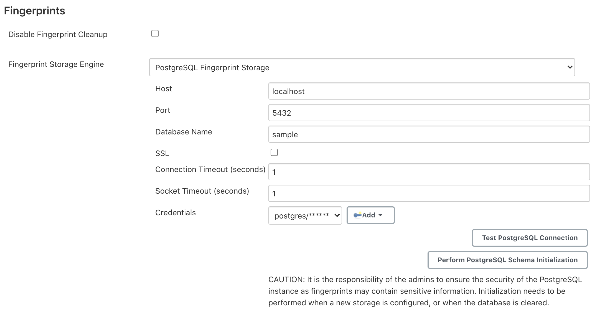

= PostgreSQL Fingerprint Storage Plugin

link:https://ci.jenkins.io/job/Plugins/job/postgresql-fingerprint-storage-plugin/job/master/[
image:https://ci.jenkins.io/job/Plugins/job/postgresql-fingerprint-storage-plugin/job/master/badge/icon[Build]]
link:https://lgtm.com/projects/g/jenkinsci/postgresql-fingerprint-storage-plugin/context:java[
image:https://img.shields.io/lgtm/grade/java/g/jenkinsci/postgresql-fingerprint-storage-plugin.svg?logo=lgtm&logoWidth=18[Language grade: Java]]
link:https://github.com/jenkinsci/postgresql-fingerprint-storage-plugin/graphs/contributors[
image:https://img.shields.io/github/contributors/jenkinsci/postgresql-fingerprint-storage-plugin.svg?color=blue[Contributors]]
link:https://gitter.im/jenkinsci/external-fingerprint-storage[
image:https://badges.gitter.im/jenkinsci/external-fingerprint-storage.svg[Gitter]]


== Introduction

The plugin allows users to configure PostgreSQL for storing fingerprints.

Another plugin which supports link:https://github.com/jenkinsci/redis-fingerprint-storage-plugin/[
storing fingerprints externally, but inside Redis instances] is also available.
Consider trying it out too! It is much more stable than this plugin at the moment,
and also supports fingerprint cleanup, which is currently unsupported in this plugin.

The plugin is currently under active development, please refer to the
link:https://www.jenkins.io/projects/gsoc/2020/projects/external-fingerprint-storage/[project page] for the latest
status.

== Installation

Clone the repository

```
git clone https://github.com/jenkinsci/postgresql-fingerprint-storage-plugin
cd postgresql-fingerprint-storage-plugin
```

To obtain the `postgresql-fingerprint-storage.hpi` and `postgresql-fingerprint-storage.jar` files, run:
```
mvn clean install
```

They will be available inside `./plugin/target`.
(Note that docker is required for running tests.
If Docker is not installed, consider skipping tests)

To run the plugin on a local instance, run:

```
cd plugin
mvn hpi:run
```

== Configuring the plugin

=== Using the Web UI

Once the plugin has been installed, you can configure the PostgreSQL server details by following the steps below:

. Select `Manage Jenkins`

. Select `Configure System`

. Scroll to the section `Fingerprints`

. Select `PostgreSQL Fingerprint Storage` from the dropdown for Fingerprint Storage Engine and fill in the required
details:

+



+

* `Host` - Enter hostname where PostgreSQL is running

* `Port` - Specify the port on which PostgreSQL is running

* `Database Name` - Database name has to be specified here.

* `SSL` - Click if SSL is enabled

* `Connection Timeout` - Set the connection timeout duration in seconds.

* `Socket Timeout` - Set the socket timeout duration in seconds.

* `Credentials` - Configure authentication using username and password to the PostgreSQL instance.

. Use the `Test PostgreSQL Connection` to verify that the details are correct and Jenkins is able to connect to the
PostgreSQL instance.

. [IMPORTANT] When configuring the plugin for the first time, it is highly important to press the
`Perform PostgreSQL Schema Initialization` button.
The button can also be used in the case the database is wiped out and schema needs to be recreated.

. Press the `Save` button.

. Now, all the fingerprints produced by this Jenkins instance should be saved in the configured PostgreSQL server!

=== Using Jenkins Configuration as Code Plugin (JCasC)

The plugin can also be configured using the
link:https://github.com/jenkinsci/configuration-as-code-plugin[configuration as code plugin] but there is one
caveat at the moment.
The schema for the PostgreSQL instance has to be initialized by going to the
configuration page, as mentioned in the previous section.

A sample YAML file is provided below for configuring this plugin using JCasC:

```
unclassified:
  fingerprints:
    storage:
      postgreSQL:
        host: "localhost"
        port: 6379
        ssl: false
        databaseName: 0
        connectionTimeout: 3000
        socketTimeout: 3000
        credentialsId: "foo"
```

== Reaching Out

Feel free to reach out to us for any questions, feedback, etc. on the project's
link:https://gitter.im/jenkinsci/external-fingerprint-storage[Gitter Channel] or the
mailto:jenkinsci-dev@googlegroups.com[Jenkins Developer Mailing list]

We use Jenkins link:https://issues.jenkins-ci.org/[Jira] to track issues.
Feel free to file issues under `postgresql-fingerprint-storage-plugin` component.

== References

* link:https://github.com/jenkinsci/jep/tree/master/jep/226[JEP-226]

* link:https://www.jenkins.io/projects/gsoc/2020/projects/external-fingerprint-storage/[Project Page]
