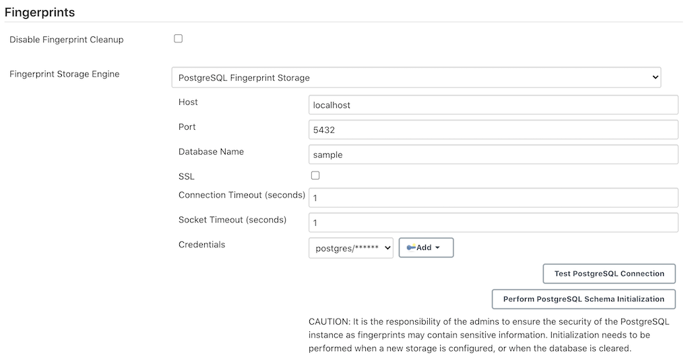

# PostgreSQL Fingerprint Storage Plugin

> [!CAUTION]
> This plugin is in alpha stage and is not recommended for production instance
>
> It's configuration might change in future releases


[](https://github.com/jenkinsci/postgresql-fingerprint-storage-plugin/releases/latest)
[](https://plugins.jenkins.io/postgresql-fingerprint-storage)


# Introduction

The plugin allows users to configure PostgreSQL for storing
fingerprints.

Another plugin which supports [storing fingerprints externally, but
inside Redis
instances](https://github.com/jenkinsci/redis-fingerprint-storage-plugin/)
is also available. Consider trying it out too! It is much more stable
than this plugin at the moment, and also supports fingerprint cleanup,
which is currently unsupported in this plugin.

# Installation

Clone the repository

```bash
git clone https://github.com/jenkinsci/postgresql-fingerprint-storage-plugin
cd postgresql-fingerprint-storage-plugin
```

To obtain the `postgresql-fingerprint-storage.hpi` and
`postgresql-fingerprint-storage.jar` files, run: `mvn clean install`

They will be available inside `./plugin/target`. (Note that docker is
required for running tests. If Docker is not installed, consider
skipping tests)

To run the plugin on a local instance, run:

```bash
cd plugin mvn hpi:run
```

# Configuring the plugin

## Using the Web UI

Once the plugin has been installed, you can configure the PostgreSQL
server details by following the steps below:

Ensure you have PostgreSQL as global database. Plugin will not work for other database engine.

1.  Select `Manage Jenkins`
2.  Select `Configure System`


4.  Save the config
4.  Scroll to the section `Fingerprints`
5.  Select `PostgreSQL Fingerprint Storage` from the dropdown for
    Fingerprint Storage Engine and fill in the required details:



  1.  Use the `Test PostgreSQL Connection` to verify that the details
      are correct and Jenkins is able to connect to the PostgreSQL
      instance.
  2.  \[IMPORTANT\] When configuring the plugin for the first time, it
      is highly important to press the
      `Perform PostgreSQL Schema Initialization` button. The button can
      also be used in the case the database is wiped out and schema
      needs to be recreated.
  3.  Press the `Save` button.
  4.  Now, all the fingerprints produced by this Jenkins instance should
      be saved in the configured PostgreSQL server!

## Using Jenkins Configuration as Code Plugin (JCasC)

The plugin can also be configured using the [configuration as code
plugin](https://github.com/jenkinsci/configuration-as-code-plugin) but
there is one caveat at the moment. The schema for the PostgreSQL
instance has to be initialized by going to the configuration page, as
mentioned in the previous section.

A sample YAML file is provided below for configuring this plugin using
JCasC:

```yaml
unclassified:
  fingerprints:
    storage:
      postgreSQL:
        host: "localhost"
        port: 6379
        ssl: false
        databaseName: 0
        connectionTimeout: 3000
        socketTimeout: 3000
        credentialsId: "foo"
```

# Reaching Out

Feel free to reach out to us for any questions, feedback, etc. on the
project’s [Gitter
Channel](https://gitter.im/jenkinsci/external-fingerprint-storage) or
the [Jenkins Developer Mailing
list](mailto:jenkinsci-dev@googlegroups.com)

We use Jenkins [Jira](https://issues.jenkins-ci.org/) to track issues.
Feel free to file issues under `postgresql-fingerprint-storage-plugin`
component.

# Attribution

The source code includes `JettisonMappedXmlDriver` and
`JettisonStaxWriter` which have been taken from
<http://x-stream.github.io/>.

# References

- [JEP-226](https://github.com/jenkinsci/jep/tree/master/jep/226)

- [Project
  Page](https://www.jenkins.io/projects/gsoc/2020/projects/external-fingerprint-storage/)
